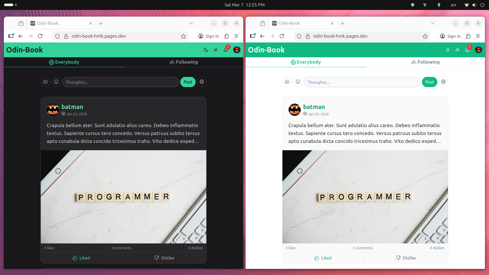
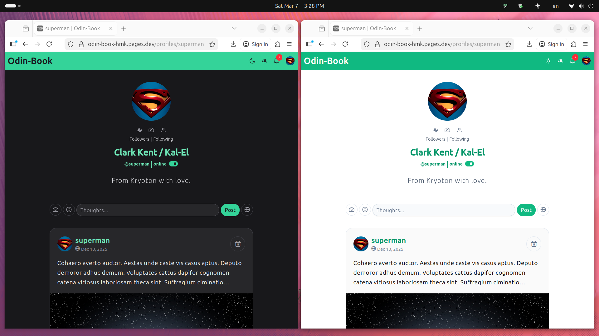
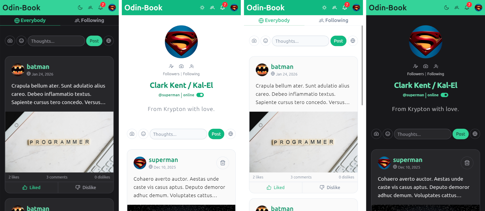

# [Odin-Book](https://odin-book-hmk.pages.dev/)

A minimal social media web application built as the final project for
**[The Odin Project](https://www.theodinproject.com/)** curriculum.

---

## Screenshots





---

## Overview

**Odin Book** is a simplified social media platform where users can
create posts, follow others, interact with others, and receive real-time updates.

Authenticated users can:

- Sign up, sign in, and sign out
- Create posts that may contain text, images, and emojis 😎
- Follow or unfollow other users
- See all posts, and/or posts from profiles they follow
- Like or dislike posts
- Comment on posts
- Delete their own posts and comments
- View others' profile pages
- Browse profiles and followers/following lists
- Receive notifications for interactions
- Get real-time updates via WebSockets

The project focuses on building a responsive client application that
manages complex UI state while interacting with a REST API and real-time
services.

---

## Tech Stack

This project emphasizes client-server architecture, real-time communication,
and scalable UI state management in a modern Angular application.

### Frontend

The frontend is built using a modern, zoneless Angular architecture
that leverages reactive patterns and modular services.

**Technologies used**:

- Angular 21
- TypeScript
- RxJS
- Vitest
- Socket.IO
- tailwindcss
- Angular Testing Library
- PrimeNG with Tailwind-based theming

**The application also includes**:

- Global loading and error handling components
- Lazy-loaded UI utilities such as emoji data
- Route resolvers and guards
- Custom services for state synchronization and API communication

### Backend

This repository contains the **front-end application**,
which communicates with the back-end API from the
[Generic Express Service](https://github.com/hussein-m-kandil/generic-express-service).

**Here are some of the technologies used on the backend**:

- Node.js/Express
- PostgreSQL
- Prisma
- Passport
- Socket.IO
- JWT-based authentication

---

## Testing

Component tests utilize:

- Vitest
- JSDOM
- Angular Testing Library

Service tests rely on Angular's built-in testing utilities.

Tests primarily focus on UI behavior, service logic, and interaction
between components and the API.

---

## Local Development

### Requirements

**Note**: Make sure to meat the requirements of every requirement.

- [Angular CLI v21](https://angular.dev/installation#install-angular-cli) installed globally.
- A local clone of the
  [Generic Express Service](https://github.com/hussein-m-kandil/generic-express-service).

### Setup

#### 1. Clone and set up the backend

```bash
git clone git@github.com:hussein-m-kandil/generic-express-service.git
cd generic-express-service
npm install
# Configure the .env file (DB connection, ports, etc.)
cp .env.test .env
# Start PostgreSQL via Docker Compose
npm run pg:up
# Build and start the backend in production mode
npm run build
npm start
```

The app should be available at <http://localhost:8080>.

---

#### 2. Clone and set up this project

```bash
git clone git@github.com:hussein-m-kandil/odin-book.git
cd odin-book
npm install
# Copy the environment file for development
cp src/environments/environment.development.ts src/environments/environment.ts
# Run tests to verify setup (optional)
npm run test -- --run
# Start the development server
npm start
```

The app will be available at <http://localhost:4200>.

---

## Scripts

| Command              | Description                                    |
| -------------------- | ---------------------------------------------- |
| `npm install`        | Installs dependencies.                         |
| `npm start`          | Starts the development server.                 |
| `npm test`           | Runs all project tests.                        |
| `npm lint`           | Checks for linting issues.                     |
| `npm run build`      | Builds the project for production.             |
| `npm run type-check` | Type-checks all source files.                  |
| `npm run build:zip`  | Builds the project and zips the browser files. |

---

## Project Status & Maintenance

This project was built primarily for learning and practice as part of The Odin Project.
It is not intended for long-term maintenance or production use.

To keep public demos manageable, I have implemented backend logic
that automatically resets the database state at regular intervals.
